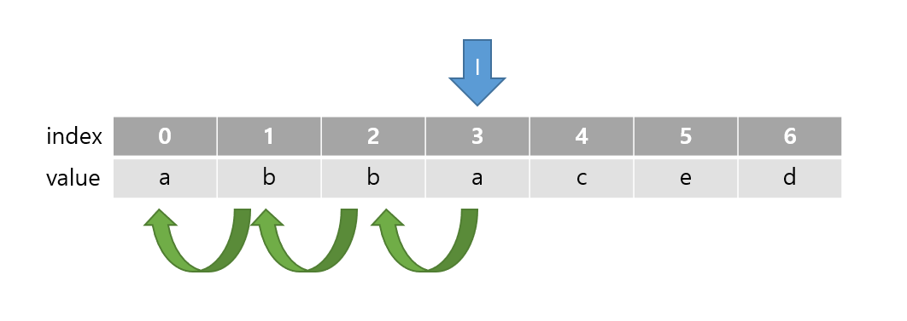

# Algorithm_JAVA

### 1. 소개

✔ 알고리즘 스터디를 진행하면서, 백준 및 프로그래머스 사이트에서 자바로 푼 알고리즘 문제를 백업해둔 저장소 입니다.

<br>

<br>

<br>

<hr>

### 2. 문제 해설 

##### ◈ 프로그래머스 - [가장 긴 팰린드롬](https://programmers.co.kr/learn/courses/30/lessons/12904) (2021.10.06 스터디)



⑴ 팰린드롬의 길이가 1인 경우와 2인 경우를 먼저 구한 뒤 3이상 부터는 따로 이중 for문을 사용해서 탐색.

⑵ 이중 for문은 i=2부터 시작하며, j는 1부터 i+1 까지 돌며 j값을 하나씩 증가 시킴. 이러한 과정에서 i-j i값 기준으로 뒤로 한 칸 씩 이동하게 됨.

⑶ 뒤로 이동하면서 기존 문자열과 같은지 탐색하고, 같은 경우 i와 i-j 사이에 있는 문자열이 팰린드롬인지 확인. 팰린드롬이면 i-j ~ i 까지 팰린드롬이라는 뜻으로 ```dp[i-j][i]=1``` 진행

⑷ answer 같은 경우 가장 긴 값을 넣기 위해 max값으로 비교해줌

