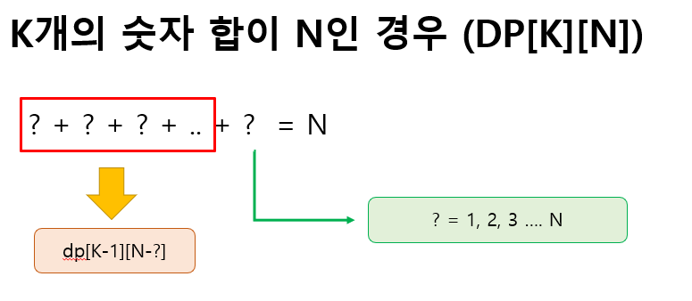

# Algorithm_JAVA

### 1. 소개

✔ 알고리즘 스터디를 진행하면서, 백준 및 프로그래머스 사이트에서 자바로 푼 알고리즘 문제를 백업해둔 저장소 입니다.

<br>

<br>

<br>

<hr>

### 2. 문제 해설 

##### ◈ 프로그래머스 - [가장 긴 팰린드롬](https://programmers.co.kr/learn/courses/30/lessons/12904) (2021.10.06 스터디)


⑴ 팰린드롬의 길이가 1인 경우와 2인 경우를 먼저 구한 뒤 3이상 부터는 따로 이중 for문을 사용해서 탐색.

⑵ 이중 for문은 i=2부터 시작하며, j는 1부터 i+1 까지 돌며 j값을 하나씩 증가 시킴. 이러한 과정에서 i-j i값 기준으로 뒤로 한 칸 씩 이동하게 됨.

⑶ 뒤로 이동하면서 기존 문자열과 같은지 탐색하고, 같은 경우 i와 i-j 사이에 있는 문자열이 팰린드롬인지 확인. 팰린드롬이면 i-j ~ i 까지 팰린드롬이라는 뜻으로 ```dp[i-j][i]=1``` 진행

⑷ answer 같은 경우 가장 긴 값을 넣기 위해 max값으로 비교해줌

<br>

<br>

**◈ 백준- [퇴사](https://www.acmicpc.net/problem/14501) (2021.11.03 스터디)**


⑴ 이중 for문으로 순차적으로 배열에 접근하면 문제에서 요구하는 최대 금액에 맞출 수 없는 경우가 생김 (예제 입력 4같은 경우)

⑵ 재귀로 각 index에서 나올 수 있는 모든 경우를 탐색해 최대 값을 구함

<br>

<br>

**◈ 백준- [색종이만들기](https://www.acmicpc.net/problem/2630) (2022.01.05 스터디)**


⑴ 이분탐색 + 재귀

⑵ 기준점을 잡고 4등분하고 각 부분의 시작점을 기준점 기준으로 계산

<br>

<br>

**◈ 백준- [행렬곱셈](https://www.acmicpc.net/problem/10830) (2022.01.12 스터디)**


<br>

<br>

◈ 백준- [합분해](https://www.acmicpc.net/problem/2225) (2022.02.09 스터디)



⑴ 1개의 숫자의 합이 N이 되는 경우는 모든 N에 대해서 1개 밖에 없음

⑵ 2개 이상의 숫자를 사용할 때부터 이미지 속의 공식이 필요함

⑶ 물음표는 결국, N이하일 수 밖에 없음 (K개의 숫자의 합이 N개 인데, 숫자가 N이상이면 합하면 N이상의 값이 나옴)
